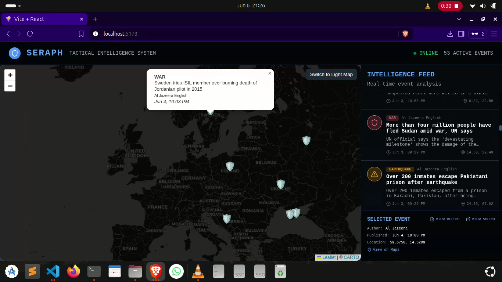

# SERAPH
**Situational Event Reporting & Analysis Platform for Hazards**

A modern intelligence dashboard for real-time global event monitoring, analysis, and reporting.

---

## Demo

Below are screenshots demonstrating SERAPH in action:

| Map View | Event Feed | Event Details | PDF Report | Dark Mode | Error State |
|---|---|---|---|---|---|
|  |  |  |  |  |  |

---

## Table of Contents
- [Key Features](#key-features)
- [Technology Stack](#technology-stack)
- [Project Structure](#project-structure)
- [Installation](#installation)
- [Usage](#usage)
- [Functionality Deep Dive](#functionality-deep-dive)
  - [Map Interaction](#map-interaction)
  - [Intelligence Feed](#intelligence-feed)
  - [Report Generation](#report-generation)
  - [Backend API](#backend-api)
- [Credits & Data Sources](#credits--data-sources)
- [Contributing](#contributing)
- [License](#license)

---

## Key Features

🗺️ **Interactive Global Map:** Visualizes geopolitical and natural disaster events on a Leaflet map with custom markers.

📊 **Real-time Intelligence Feed:** Displays a live-updating list of events with key details, sourced from a backend API.

📰 **Detailed Event Analysis:** Select any event on the map or from the feed to view comprehensive details, including location, time, and source.

📄 **On-Demand PDF Reports:** Fetches detailed Markdown-based dossiers for any event and converts them to downloadable PDF reports on the fly.

🌙 **Light & Dark Mode:** Switch between map themes for optimal viewing in any environment.

📱 **Responsive Layout:** A clean, modern interface designed for intelligence analysis.

✅ **Robust State Management:** Gracefully handles loading and error states for a smooth user experience.

---

## Technology Stack

- **Core:** React.js, Vite
- **Mapping:** React-Leaflet & Leaflet.js
- **Icons:** Lucide React
- **PDF Generation:** html2pdf.js
- **Markdown Parsing:** Marked.js
- **Styling:** CSS Modules / animations.css

---

## Project Structure

```
/src
|
|-- components/
|   |-- ErrorScreen.jsx       # Component for displaying fetch errors
|   |-- EventDetails.jsx      # Panel for the selected event's details + PDF generation
|   |-- EventList.jsx         # The scrollable list of event cards in the sidebar
|   |-- Header.jsx            # The top navigation and status bar
|   |-- LoadingScreen.jsx     # The initial loading screen
|   |-- Map.jsx               # The main Leaflet map container and markers
|   |-- Sidebar.jsx           # The right-hand sidebar containing the feed and details
|
|-- App.jsx                   # Main application component, handles state and layout
|-- animations.css            # Global CSS keyframe animations
|-- utils.js                  # Helper functions (formatting, icon selection, etc.)
|-- index.js                  # Entry point of the React application
```

---

## Installation

1. **Clone the repository:**
   ```sh
   git clone https://github.com/yourusername/seraph-dashboard.git
   cd seraph-dashboard
   ```
2. **Install dependencies:**
   ```sh
   npm install
   ```
3. **Start the development server:**
   ```sh
   npm run dev
   ```
4. **Build for production:**
   ```sh
   npm run build
   ```

---

## Usage

- Open [http://localhost:5173](http://localhost:5173) in your browser.
- Interact with the map to explore events.
- Click on events for detailed analysis and PDF report generation.
- Use the sidebar feed for real-time updates.

---

## Functionality Deep Dive

### Map Interaction
- Powered by **React-Leaflet** for smooth, interactive mapping.
- Custom markers indicate event types (e.g., natural disasters, conflicts).
- Click markers to view event details.

### Intelligence Feed
- Sidebar lists events in real-time, auto-updating as new data arrives.
- Click any feed item to focus the map and open the event details panel.

### Report Generation
- Each event detail panel includes a "Generate PDF" button.
- Uses **Marked.js** to render Markdown dossiers and **html2pdf.js** for PDF export.

### Backend API
- Events are fetched from a RESTful API (see `/src/utils.js` for endpoints).
- Handles loading and error states with dedicated UI components.
- **World events are obtained via the [Shofar API](https://github.com/alestor123/shofar)**, which is accessed locally at `http://localhost:3000/api/v1/main` when running the backend.

---

## Credits & Data Sources

- **NewsAPI**: Some event data and news content are sourced from [NewsAPI.org](https://newsapi.org/). Please review and comply with their [terms of use](https://newsapi.org/terms).
- **Shofar API**: This application uses the [Shofar API](https://github.com/alestor123/shofar) for obtaining world events. When hosted locally, the API endpoint is `http://localhost:3000/api/v1/main`.

> **Legal Notice:**
> Use of third-party APIs and data sources is subject to their respective licenses and terms of service. Unauthorized or commercial use of NewsAPI or Shofar API data may have legal consequences. Always review and comply with the terms of use for each data provider.

---

## Contributing

1. Fork the repository.
2. Create your feature branch: `git checkout -b feature/YourFeature`
3. Commit your changes: `git commit -am 'Add some feature'`
4. Push to the branch: `git push origin feature/YourFeature`
5. Open a pull request.

---

## License

This project is licensed under the **MIT License**. See [LICENSE](LICENSE) for details.

---

**SERAPH** — Situational Event Reporting & Analysis Platform for Hazards  
Empowering analysts with actionable, real-time intelligence.
